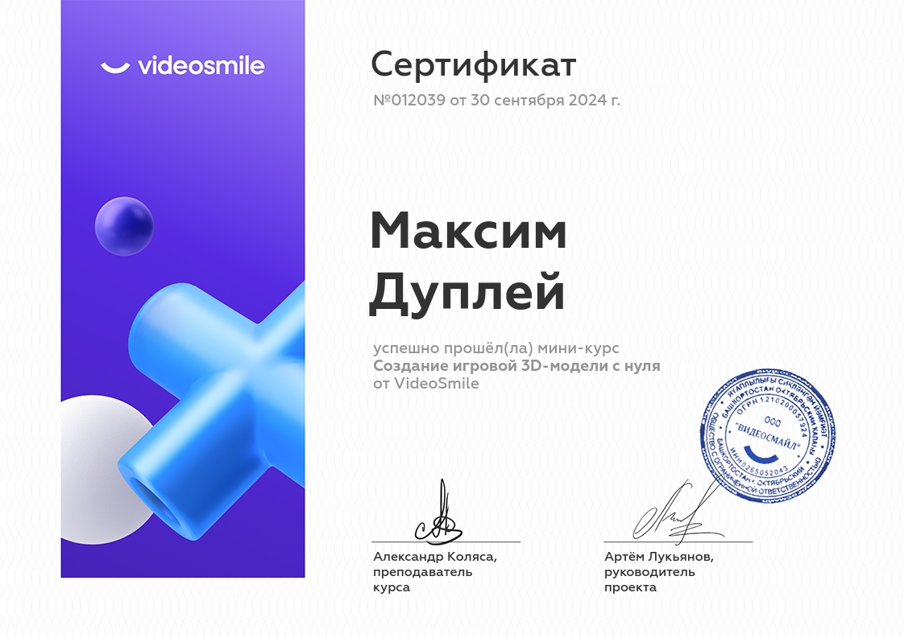
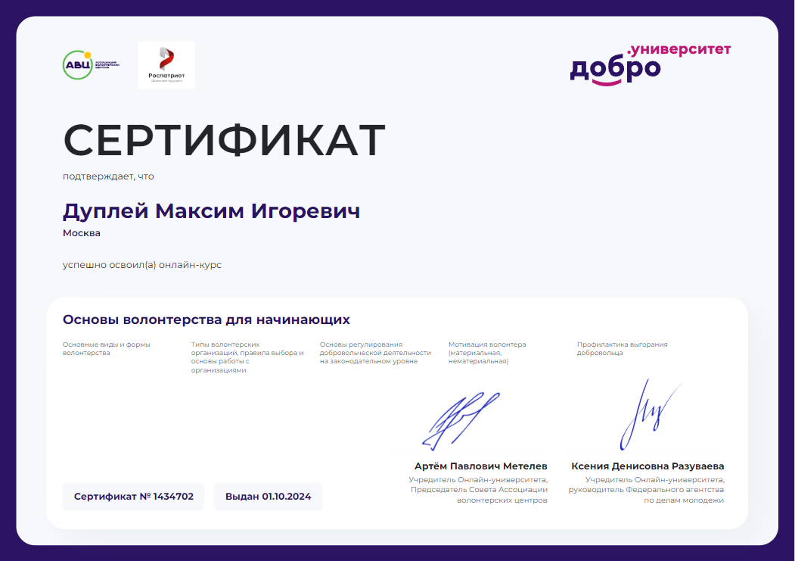

# Certificates-of-Participation
📃 Сертификаты и наградные дипломы

### Certificates of Coursera:
#### 1. Technical Support Fundamentals by Google

#### 2. Foundations of Project Management by Google

#### 3. Foundations of Cybersecurity by Google

#### 4. Introduction to DevOps by IBM

#### 5. Creating a 3D game model from Blender

#### 6. Волонтёрство

#### 7. [Как зарабатывать культурным проектам ?](<mastera.academy/Как зарабатывать культурным проектам.pdf>)

#### 8. [Как найти деньги на проект ?](<mastera.academy/Как найти деньги на проект.pdf>)

#### 9. [Копирайтинг в крауд-кампании](<Planeta_ru/Copywriting in a crowdfunding campaign.pdf>)

#### 10. [Особенности и фишки краудфандинговых платформ](<Planeta_ru/Features and tricks of crowdfunding platforms.pdf>)

#### 11. [Юридические и бухгалтерские аспекты краудфандинга](<Planeta_ru/Legal and accounting aspects of crowdfunding.pdf>)

#### 12. [Убойные секреты краудфандинга. Что скрывают успешные проекты ?](<Planeta_ru/Secrets of crowdfunding.pdf>)

#### 13. [SMM в краудфандинге](<Planeta_ru/SMM in crowdfunding.pdf>)

#### 14. [Видеообращение крауд-проекта](<Planeta_ru/Video message of the crowdfunding project.pdf>)

#### 15. Инфографика для крауд-кампаний

.png>)

#### 16. Project management. From theory to practice - RUDN

#### 17. History of International Relations and Foreign Policy of - RUDN

#### 18. Благодарственное письмо АНО ВО «Университет Иннополис» Дуплей Максим Игоревич

##### 📑 Ссылки на социальные сети:

##### 🏷️1. [YouTube channel](https://www.youtube.com/channel/UCqA5pl9NkVDrirMDlNVmU7g "«Хижина программиста»")

##### 🏷️2. [Наука и Техника 𖤍](https://vk.com/science_geeks "Scientific, technological and educational community 𖤍")

##### 🏷️3. [Courses by Stepik](https://stepik.org/users/150943726/teach "Professor: Dupley Maxim Igorevich")
